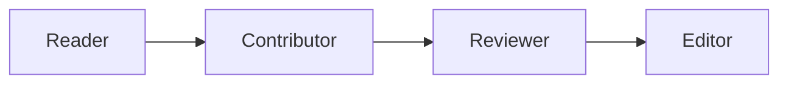

# VU Research Support Handbook

#favorite dessert
Thomas: Ice

Welcome to the source code for VU Amsterdam Research Support Handbook! If you want to report a problem or suggest a new page, [you can do so using our contribution portal](https://ez-github-contributor.netlify.app/).

## What is this?

This is a community led handbook for all things related to research at VU. The handbook is split into **topics** and **guides**.

> [Topics](https://ubvu.github.io/open-handbook/topics.html) - self-contained descriptions of specific things relevant to your work at VU Amsterdam.

> [Guides](https://ubvu.github.io/open-handbook/guides.html) - a collection of topics in a meaningful order to achieve a goal

All information in the handbook is specific to VU's local context. We are happy to hear if things are (un)helpful and you work at VU Amsterdam.

## Blog

The handbook also [has a blog](https://ubvu.github.io/open-handbook/blog.html), which you can [follow on RSS](https://ubvu.github.io/open-handbook/blog.xml). If you'd like to write a blog post, you are more than welcome to share it with us.

Our requirements for blogs:

* It articulates its relevance to VU employees
* It has a clear message and communicates it effectively
* It is clear and concise

We will assess blogs on a case by case basis before including them. Please mind that we may not immediately post your blog and submitting one does not entitle you to it being posted.

## Contributors

There are many kinds of contributions. We see the following contribution ladder for the Research Support Handbook. 

Contributions can be anything, from reporting typo's to opening up an issue, or drafting new pages. Reviewers help check new content for accuracy before it gets published. Editors take care of the entire handbook, ensure general consistency, and progress the handbook.

<!-- ALL-CONTRIBUTORS-LIST:START - Do not remove or modify this section -->
<!-- prettier-ignore-start -->
<!-- markdownlint-disable -->

All contributions to this project are gratefully acknowledged using the [`allcontributors` package](https://github.com/ropensci/allcontributors) following the [all-contributors](https://allcontributors.org) specification. Contributions of any kind are welcome!

<table>

<tr>
<td align="center">
 
<a href="https://github.com/ubvu/open-handbook/commits?author=chartgerink">chartgerink</a>
</td>
<td align="center">
 
<a href="https://github.com/ubvu/open-handbook/commits?author=Jolien-S">Jolien-S</a>
</td>
<td align="center">
 
<a href="https://github.com/ubvu/open-handbook/commits?author=Elisa-on-GitHub">Elisa-on-GitHub</a>
</td>
<td align="center">
 
<a href="https://github.com/ubvu/open-handbook/commits?author=peer35">peer35</a>
</td>
<td align="center">
 
<a href="https://github.com/ubvu/open-handbook/commits?author=Karvovskaya">Karvovskaya</a>
</td>
<td align="center">
 
<a href="https://github.com/ubvu/open-handbook/commits?author=meronvermaas">meronvermaas</a>
</td>
<td align="center">
 
<a href="https://github.com/ubvu/open-handbook/commits?author=jensdebruijn">jensdebruijn</a>
</td>
</tr>

<tr>
<td align="center">
 
<a href="https://github.com/ubvu/open-handbook/commits?author=jhrudey">jhrudey</a>
</td>
<td align="center">
 
<a href="https://github.com/ubvu/open-handbook/commits?author=Alex-van-der-Jagt">Alex-van-der-Jagt</a>
</td>
<td align="center">
 
<a href="https://github.com/ubvu/open-handbook/commits?author=Dimitri-Unger">Dimitri-Unger</a>
</td>
<td align="center">
 
<a href="https://github.com/ubvu/open-handbook/commits?author=timveken">timveken</a>
</td>
<td align="center">
 
<a href="https://github.com/ubvu/open-handbook/commits?author=Sergi095">Sergi095</a>
</td>
<td align="center">
 
<a href="https://github.com/ubvu/open-handbook/commits?author=TMHofstra">TMHofstra</a>
</td>
<td align="center">
 
<a href="https://github.com/ubvu/open-handbook/commits?author=imartorelli">imartorelli</a>
</td>
</tr>

<tr>
<td align="center">
 
<a href="https://github.com/ubvu/open-handbook/commits?author=KirianneG">KirianneG</a>
</td>
<td align="center">
 
<a href="https://github.com/ubvu/open-handbook/commits?author=olindensen77">olindensen77</a>
</td>
<td align="center">
 
<a href="https://github.com/ubvu/open-handbook/commits?author=vansteph">vansteph</a>
</td>
<td align="center">
 
<a href="https://github.com/ubvu/open-handbook/commits?author=ELNijland">ELNijland</a>
</td>
<td align="center">
 
<a href="https://github.com/ubvu/open-handbook/commits?author=gus-mxx">gus-mxx</a>
</td>
<td align="center">
 
<a href="https://github.com/ubvu/open-handbook/commits?author=emilybarabas-vu">emilybarabas-vu</a>
</td>
<td align="center">
 
<a href="https://github.com/ubvu/open-handbook/commits?author=reinout538">reinout538</a>
</td>
</tr>

<tr>
<td align="center">
 
<a href="https://github.com/ubvu/open-handbook/commits?author=MarcelRas-391">MarcelRas-391</a>
</td>
<td align="center">
 
<a href="https://github.com/ubvu/open-handbook/commits?author=CMOGUZ">CMOGUZ</a>
</td>
<td align="center">
 
<a href="https://github.com/ubvu/open-handbook/commits?author=D-Unger">D-Unger</a>
</td>
<td align="center">
 
<a href="https://github.com/ubvu/open-handbook/commits?author=sarnoult">sarnoult</a>
</td>
<td align="center">
 
<a href="https://github.com/ubvu/open-handbook/commits?author=davor-cc">davor-cc</a>
</td>
<td align="center">
 
<a href="https://github.com/ubvu/open-handbook/commits?author=tmunker">tmunker</a>
</td>
<td align="center">
 
<a href="https://github.com/ubvu/open-handbook/commits?author=Kostusas">Kostusas</a>
</td>
</tr>

</table>

<!-- markdownlint-enable -->
<!-- prettier-ignore-end -->
<!-- ALL-CONTRIBUTORS-LIST:END -->

