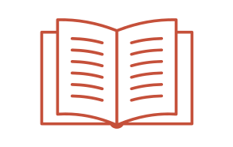
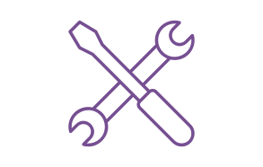
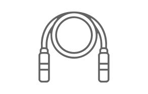

::: {.home-main}
::: {.text-center .px-md-5}
::: {.main-title}
Research Support Handbook
:::
::: {.pb-2 .main-subtitle}
Your Guide Towards Good Data and Software Management Practices
:::
All information is curated by VU staff and updated on a daily basis
:::

---

::: {.text-center .px-md-5}
::: {.h3}
Topics, Guides and Tools
:::
:::

::: {.text-center .px-md-5}
::: {.column width=30% .px-1}
[{width=6em}](./topics.qmd)  
[Topics](./topics.qmd)

A quick way to learn about specific topics
:::
::: {.column width=30% .px-1}
[{width=6em}](./guides.qmd)  
[Guides](./guides.qmd)

Guide you through data and software management practices
:::
::: {.column width=30% .px-1}
[{width=6em}](./tools.qmd)  
[Tools](./tools.qmd)

How to use VU-supported research tools
:::
:::

---

::: {.text-center .px-md-5}
::: {.h3}
Related Trainings and Events
:::
The VU Network Research Data Support organises trainings that will help you develop your data management and coding skills, as well as events for researchers and support staff to exchange ideas and experiences relevant to good research practices.
:::

::: {.column-screen}
::: {.column-page .text-center .px-md-5 .pb-5}
::: {.column width=40% .px-1}
[{width=6em}](https://libcal.vu.nl/calendar/universitylibrary?cid=7052&t=g&d=0000-00-00&cal=7052&ct=32115&inc=0)  
[Calendar](https://libcal.vu.nl/calendar/universitylibrary?cid=7052&t=g&d=0000-00-00&cal=7052&ct=32115&inc=0)
:::
::: {.column width=40% .px-1}
[{width=6em}](trainings.qmd)  
[Trainings](trainings.qmd)
:::
:::
:::
:::
