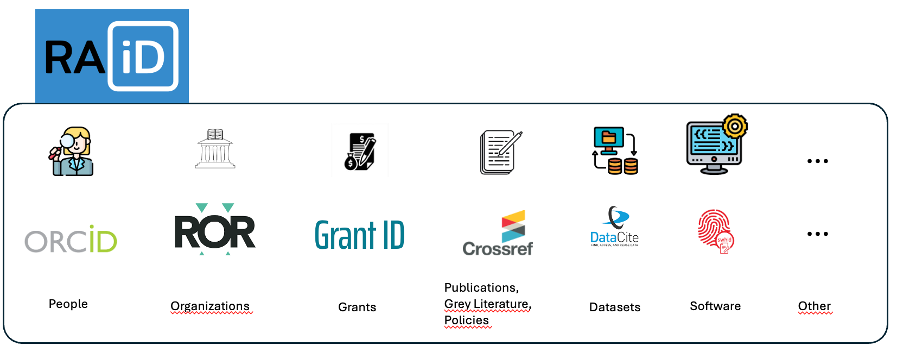
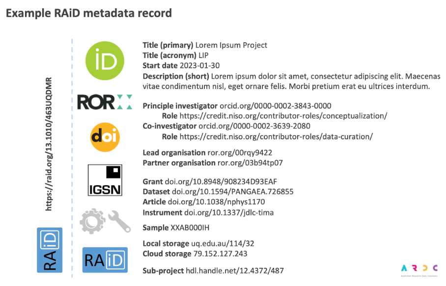

The Research Activity Identifier (RAiD) is a [persistent identifier(../topics/persistent-identifier.qmd) (PID) and global registry dedicated to research projects. It provides a system to store, update, share, and link project information across the research community.

## The advantages of RAiD

A recurring challenge in research is managing the many complex activities involved in a research project. As time goes by, it becomes increasingly hard to keep track of who is responsible for what, especially as people, institutions, and funding cycles change. RAiD, or Research Activity Identifier, was developed to address this structural gap by recognising the research project as a persistent, discoverable entity. It connects the project to its relevant context, including partners, funders, outputs and preceding and potential follow-up projects. RAiD assigns a unique identifier to each research project, making it identifiable and discoverable. In addition, RAiD functions as a ‘container’ to which existing identifiers can be linked, such as Grant ID, ORCID, ROR, DOIs, and unique records in institution's financial administrative systems. 

Through this connection at the identifier and metadata levels, no information is lost, the discoverability of data is improved, and greater oversight of projects and their results is achieved. The implementation of RAiD also contributes to facilitating Open Science and recognising and rewarding open science practices.   

## Reuse of Research Information

Because RAiD is designed as a node within a larger ecosystem of persistent identifiers, it creates a network of relationships that enables interoperability with national and international research infrastructures. Once project information is permanently recorded in a machine-readable registry, it can be reused across various grant reporting systems, archiving procedures, ethical review systems, and institutional research platforms. This reduces the risk of errors when transferring information and eliminates the need to duplicate nearly identical project descriptions. Institutional review platforms and application processes for access to research infrastructure can therefore be accelerated. For example, RAiD metadata can be used to automate access requests to high-performance computing centres, data centres, and specialised research services.

## Use of RAiD at VU Amsterdam

Open Science is a key objective for VU Amsterdam, as stated in the [VU Research Strategy 2023-2033](https://assets-eu-01.kc-usercontent.com/ff31ad68-341e-015e-fb52-24df7a00ecea/6fc36d9c-3ee5-434d-a250-c6b9792e6d0d/VU%20Onderzoeksstrategie%20EN.pdf) (p. 11) and the [VU Strategy 2026-2030](https://assets-eu-01.kc-usercontent.com/ff31ad68-341e-015e-fb52-24df7a00ecea/bb8b26c8-2daa-4ad5-b5ed-99227ade5663/VU%20strategy%202026-2030%20English%20august%202026.pdf) (p. 30). To open up scientific practices, transparency and accountability of the scientific process are crucial. For this, all information related to a research project needs to be available and easily findable, including partners, funders, outputs, related projects, financial information and project administration. RAiD brings together all this information and hence facilitates activities like reporting on academic research, creating a research portfolio, getting insight in financial flows and rewarding and recognising researchers' output.

VU Amsterdam is working on implementing RAiD in various research administration systems, enabling VU researchers to collect all relevant project information of the projects they are, have been and will be involved in and to disseminate this information where needed.
