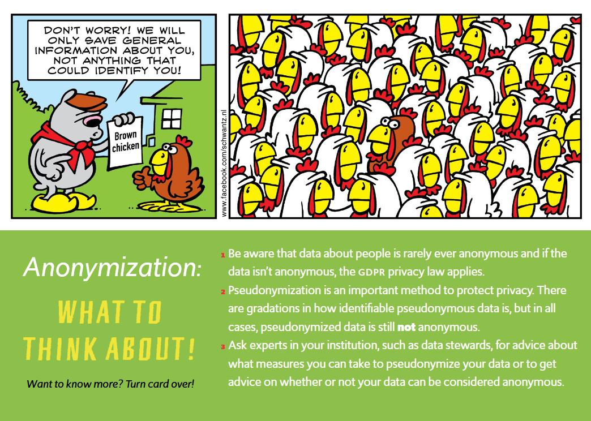
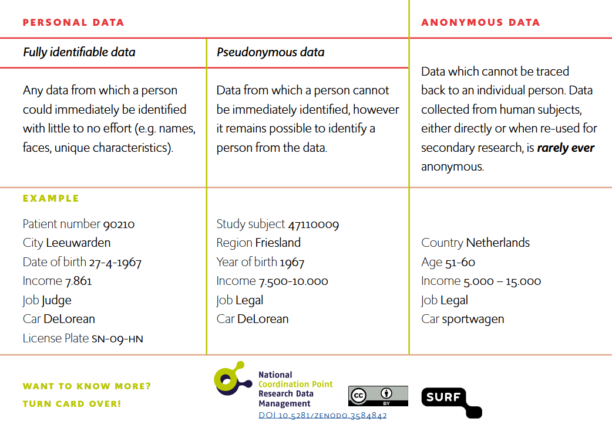

If your research involves **data about human beings**, these data probably will be identifiable, meaning that this information can reveal your research participants' identities. Take a look at the image below:

This example [@reference-card-anonymization] shows that even an apparently general description can reveal someone's identity, depending on the context. This is not problematic in itself, it means that you must make sure to carry out your research in line with the [GDPR](../topics/gdpr.qmd). Having said that, it is nevertheless useful to see if and to what extent you can make your data less identifiable. Below is explained why.

## Pseudonymisation and anonymisation

Within the [GDPR definitions](../topics/gdpr.qmd#definitions) several terms are used: pseudonymisation, anonymisation, direct identification and indirect identification. All of these terms are related to which extent it is possible to identify an individual. Pseudonymisation and anonymisation are processes that make personal data less easily linkable to individual data subjects or research participants. In other words, they are methods to de-identify personal data. If the data undergo enough de-identification that it is no longer possible to re-identify a data subject, they are considered anonymised (see also @data-privacy-handbook-uu).

The process of pseudonymisation and anonymisation is depicted in the image below.

This overview [@reference-card-anonymization] explains the difference between fully identifiable, pseudonymous and anonymous data and provides an example of how data can be made less identifiable. The data in the left-most column is fully identifiable. The information is made less identifiable in the second column, for example by replacing the patient number with a random study subject number, and by aggregating some of the data, for example by using year of birth instead of the specific date. The combination of variables in the second column still makes it possible to reveal this person's identity, but it is more difficult. In the third column, the pieces of information are aggregated even further, making it impossible to identify the person. These data are considered anonymous, but note that this information is probably too general for many scientific research purposes.

## Why is de-identification useful

Full anonymisation is not always achievable or the steps involved may render the data less useful for analysis. The extent to which you will de-identify your data depends on:

* Characteristics of the dataset
* The context in which it was obtained
* What the researcher plans to do with the data
* The resources available for de-identifying the data

Regardless of whether you fully anonymise the data or not, even a basic level of data de-identification, such as removing names and contact information from a dataset, has important advantages. De-identification helps you:

* Safeguard the privacy of research subjects, which helps maintain public trust
* Prevent developing a bias when working with the data
* Meet data protection obligations
* Decrease the privacy risks posed by your data which:
    * Increases your [data storage options](../topics/data-storage.qmd)
    * Allows you to more securely share data with appropriate parties

## Data de-identification methods

As there are many different types of data in very different formats, there is no uniform method to apply data de-identification. General considerations for de-identifying data are provided in the [Guide 'How can you de-identify personal data?'](../guides/deidentifying-data.qmd). This Guide includes references to more specific recommendations for specific types of data (e.g. audiovisual data, consent forms, imaging data, tabular data and questionnaire data).

Acknowledgement: This text is based on the Data Privacy Handbook of Utrecht University [@data-privacy-handbook-uu] and the [FGB (VU Faculty of Behavioral and Movement Sciences) Security Tips](https://fgb-rdm.nl/Security/Deidentification.html). We thank our colleagues for creating and sharing their work.

