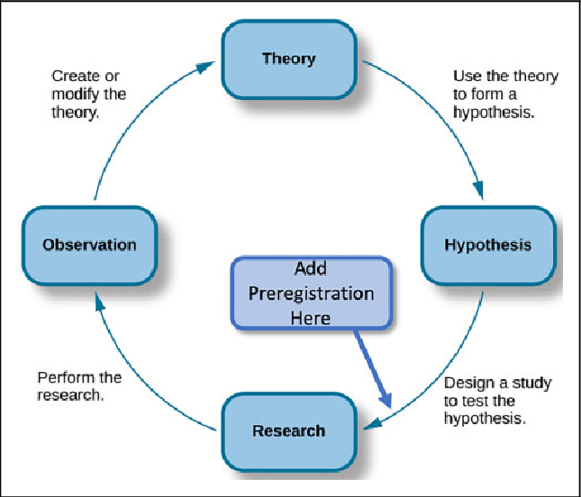

## What Is Preregistration?

According to the [Center for Open Science](https://www.cos.io/prereg), preregistration is a core open science practice that supports reproducibility and accountability. Preregistration is the process of documenting your research plan **before** data collection and storing it in a time-stamped, read-only public repository. By registering hypotheses, methods, and planned analyses in advance, researchers make their decisions transparent and clearly distinguish **confirmatory** analyses from **exploratory** ones.

*Preregistration within the theory–data cycle. Adapted from Morling & Calin-Jageman (2020).*

---

## Why Preregister?

Preregistration allows others to evaluate a study based on its design and methodological rigor, rather than only on its results. This transparency helps counteract publication bias, which favors positive findings over null or inconclusive results.

Specifying hypotheses, analytic plans, and methodological details in advance strengthens the credibility of research findings and supports accurate interpretation by readers, reviewers, and meta-analysts.

Preregistration does not prevent modifications to a research plan; however, any changes should be transparently documented and justified in the final report.

---

## How Preregistration Helps Reduce Publication Bias

Preregistration increases transparency and accountability by creating a public record of a study’s hypotheses, methods, and analysis plan before data collection. This helps reduce publication bias in several ways:

- **Records all planned studies** – Timestamped preregistration ensures that null or negative results are documented, making it harder to hide research that “doesn’t work.”
- **Encourages reporting of null results** – Reviewers and journals can see that the study was planned and conducted, promoting publication regardless of outcome.
- **Reduces selective reporting** – Predefined primary outcomes and analyses prevent highlighting only favorable results.
- **Supports meta-analyses and systematic reviews** – Including studies with null results reduces distortion of effect sizes caused by publication bias.

By making study plans public before data collection, preregistration discourages hiding studies or selectively reporting results, which are major contributors to publication bias.

---

## Questionable Research Practices Addressed by Preregistration

Preregistration promotes transparency and reduces flexible or selective analysis by documenting key research decisions before data collection. It helps limit practices such as:

- **P-hacking** – Trying multiple analyses, models, or outcome measures and reporting only those that reach statistical significance.
- **HARKing (Hypothesizing After Results are Known)** – Presenting post hoc explanations as if they were predicted beforehand.
- **Selective outcome reporting** – Measuring many variables but reporting only favorable results.
- **Optional stopping (data peeking)** – Collecting data until statistical significance is achieved.
- **Post hoc exclusion decisions** – Removing participants or outliers based on their effect on results.
- **Changing primary outcomes** – Reframing exploratory findings as confirmatory.
- **Uncorrected multiple comparisons** – Conducting many tests without adjusting for inflated Type I error.
- **Model specification searching** – Testing multiple model configurations and reporting only the most favorable one.

By documenting hypotheses, sample size, exclusion criteria, and analytic strategies in advance, preregistration clarifies the distinction between confirmatory and exploratory research and strengthens confidence in the results.

---

## Types of Preregistration

There are two main forms of preregistration:

1. **Unreviewed preregistration**

Researchers publicly register their research plan before data collection. When the study is later submitted for publication, reviewers and readers can assess how well the reported analyses match the preregistered plan.

2. **Reviewed preregistration (Registered Reports)**

Researchers submit a detailed research proposal to a journal prior to data collection. The proposal undergoes peer review, and the journal may offer in-principle acceptance based on the study’s theoretical motivation and methodological rigor, rather than its results.

---

## What to Include in a Study’s Preregistration

Preregistration should document key decisions made before data collection or analysis to promote transparency and reduce questionable research practices (Krypotos et al., 2022).

> **Note:** Different study types and disciplines may require different preregistration elements. The guidance below represents general best practices, but not every item will be applicable to all research. Researchers should consult templates and field-specific recommendations to tailor their preregistration to their study design and research context.

### Research hypotheses
Confirmatory hypotheses should be clear and specific to prevent flexible interpretation of results. Exploratory research does not require predefined hypotheses.

### Methodology
Describe materials, procedures, data sources, and data collection methods. For studies using existing data, explain how it was obtained and disclose any prior knowledge that could influence analyses. Making study materials available in a repository is encouraged to support transparency and replication.

### Sample
Specify intended sample characteristics and justify sample size (e.g., via power analysis). Document stopping rules, adaptive sampling procedures, or use of pre-existing datasets, including how training and validation datasets will be defined if applicable.

### Data preprocessing
Outline planned data transformations, exclusions, and aggregation procedures. If exact procedures cannot be fully predefined, describe planned sensitivity analyses to assess robustness.

### Statistical analysis
Specify planned statistical models, variables, and inferential framework (e.g., NHST or Bayesian analysis). Clearly documenting analytic decisions prevents bias and increases credibility. Any changes to the preregistered plan should be transparently documented.

### Templates and study-specific elements
Different study types require different preregistration elements. Researchers are encouraged to consult existing preregistration [templates](https://help.osf.io/article/330-welcome-to-registrations) and select one appropriate to their field and design (Krypotos et al., 2022).

---

## Where Can I Preregister My Research?

The [Open Science Framework (OSF)](https://www.osf.io/) provides infrastructure for managing, documenting, and sharing research projects and data. It supports collaboration and transparency by enabling researchers to organise project components and materials in a centralised environment.

COS has compiled a [list of preregistration examples](https://osf.io/e6auq/wiki?wiki=6h2fw) across disciplines. Practical guidance on preregistering studies and registering data using OSF is available here: [Registrations & Preregistrations](https://help.osf.io/article/330-welcome-to-registrations).

If you have questions about preregistering your study, please email [rdm@vu.nl](mailto:rdm@vu.nl).

---

## References and Further Reading

- Claesen, A., et al. (2020). *How preregistration affects the research workflow: Better science but more work.* PLoS ONE, 15(10), e0238823. https://doi.org/10.1371/journal.pone.0238823
- Krypotos, A. M., et al. (2022). *Preregistration: Definition, advantages, disadvantages, and how it can help against questionable research practices.* In W. O’Donohue, A. Masuda, & S. Lilienfeld (Eds.), **Avoiding Questionable Research Practices in Applied Psychology**. Springer, Cham. https://doi.org/10.1007/978-3-031-04968-2_15
- Morling, Beth & Calin-Jageman, Robert. (2020). What Psychology Teachers Should Know About Open Science and the New Statistics. Teaching of Psychology. 47. 169-179. 10.1177/0098628320901372.
- [Maastricht University Library: Preregistration in academia – Making research more findable and reliable.](https://library.maastrichtuniversity.nl/news/preregistration-in-academia-making-research-more-findable-and-reliable/)
