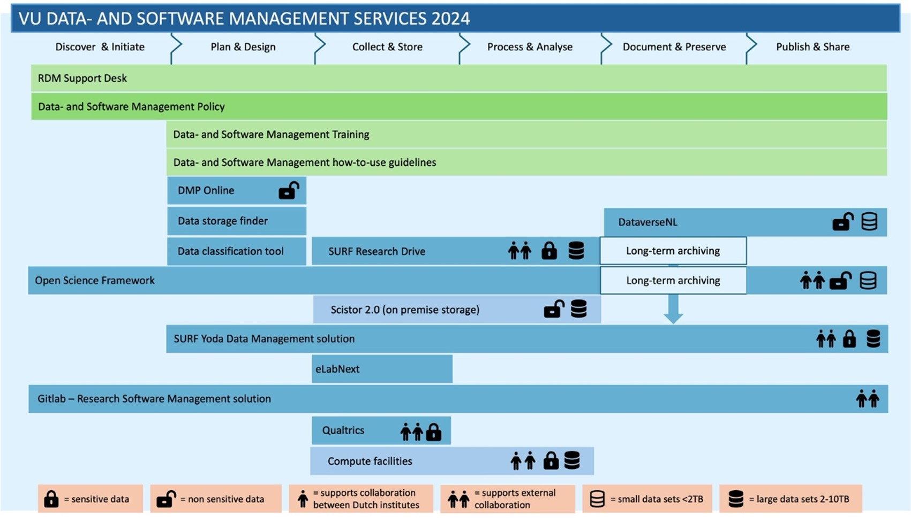

The Vrije Universiteit Amsterdam hosts a wide range of research data management (RDM) tools designed for researchers to support researchers throughout their enitre project lifecycle. 

Whether you are starting your data management plan, collecting data or looking for long-term storage solutions, RDM tools help you optimise your research process and make data handling efficient. 

## RDM tools

Code Development Tools

VU Amsterdam has a GitLab instance in which you can collaboratorively work on code:

- [GitLab](https://gitlab.vu.nl) is a code repository for **research use**; features include version control and the possibility to collaborate. Maintained by the University Library. There is also a [gitlab server for general use](https://git.vu.nl).

Computing Tools

There are several tools available to support researchers in performing computational analysis and processing data efficiently:

- [ADA](/tools/ada/index.qmd) is VU's on-campus computing cluster for multi-node computations. ADA is beneficial when your research requires more computational power than a standard laptop or workstation. It offers access to multi-core CPUs, large-memory nodes, and batch GPU capacity for effiecient large-scale data processing and analysis. Account needs to be requested via the VU Service Portal.

- [Nebula](/tools/nebula/index.qmd) is developed to support researchers who want to use AI models in their work. It provides researchers across all departments with safe and seamless access to open-source large langugae models (LLMs). Nebula is fully hosted on VU premises ensuring that no data leaves the campus.

- [Research Cloud](/tools/researchcloud/index.qmd) is a SURF-hosted portal that allows you to easily build or reuse a virtual research environment. It enables you to run one or more servers with applications that are accessible over the internet. Requires SRAM collaboration credentials and computing credits.

- [SciCloud](/tools/scicloud/index.qmd) is offered by IT for Research ([ITvO](topics/itvo.qmd)) and is based on the open-source middleware OpenNebula (ONE). It allows researchers to purchase server capacity to support their research applications. Good for web applications and 24/7 services.

- [Snellius](/tools/snellius/index.qmd) is a National Supercomputer hosted by SURF, designed for large-scale experiments, such as simulations and modelling, that require significant computing power. Access can be requested through the VU contract with SURF or through an NWO compute grant.

- [VU Compute hub](/tools/vucomputehub/index.qmd) is a JupyterHub service hosted by IT that is primarily intended for educational use, but is also available to VU researchers who need a low-threshold environment for running analyses.

Data Analysis Tools

VU Amsterdam provides licences for several data analysis tools. The different software options provided by IT are described in the 🔒 [the VU Service Portal](https://services.vu.nl/esc?id=kb_article&sysparm_article=KB0012864&table=kb_knowledge&searchTerm=spss).

You can find more information on working with data in [the VU LibGuide 'Working with data'](https://libguides.vu.nl/working-with-data/introduction).

If you have any questions about the tools listed below, you can contact the [IT Servicedesk](mailto:servicedesk.it@vu.nl). 

- [ATLAS.ti](https://atlasti.com/) is a qualitative data analysis software that supports coding, text interpretation and multimedia analysis. ATLAS.ti provides [video tutorials](https://atlasti.com/video-tutorials) to help users get started. 

- [SPSS](https://www.surfspot.nl/vu) is a quantitative statistical analysis software package used for data management, statistical analysis, and data visualisation. You can find instructions for using the SPSS licence on the 🔒 [the VU Service Portal](https://services.vu.nl/esc?id=kb_article&sysparm_article=KB0022399&table=kb_knowledge&searchTerm=spss). There are [free tutroials](https://resultnetsearch.com/?dn=how2stats.net&sksubid=44786252&_slsen=0) availible to help users get started. You can find more in-depth, paid tutorials by [Laerd Statistics](https://statistics.laerd.com/).

- [MATLAB](https://www.mathworks.com/academia/tah-portal/vrije-universiteit-amsterdam-30688271.html) is a programming language for numerical analysis, data visualisation, and algorithm development. You can find instructions for using the MATLAB licence on the 🔒 [the VU Service Portal](https://services.vu.nl/esc?id=kb_article&sysparm_article=KB0011916&table=kb_knowledge&searchTerm=matlab).

- [Stata](https://www.scienceplus.com/nl/statistiek/stata/?gad_source=1&gad_campaignid=251688141&gbraid=0AAAAAD_cwtmYS8azW8JFKlpADJ1WIR2yy&gclid=CjwKCAjwhqfPBhBWEiwAZo196pDjD5tymxrHz163VRmksMh8P6zM_YzEYpkzFDHlnssDHcKBoeMKEBoCRh4QAvD_BwE) is a statistical package used for quantitative data analysis. Stata is what IT calls 'a specific software package', meaning that it's only available for specific user groups. If you're unsure whether Stata is available for you, we recommend asking someone in your department (e.g. supervisor or head of research group). More information and tutorials can be found in [the VU LibGuide 'Working with data'](https://libguides.vu.nl/working-with-data/software/stata-sources).

Data Archiving Tools

There are several tools available to support researchers in archiving their data:

- [DataverseNL](/tools/dataversenl/index.qmd) is a data repository hosted by DANS for archiving and publishing research datasets. DataverseNL is not suitable for data files containing personal or confidential data. For archiving and publishing sensitive data, researchers should use Yoda. 

- [Yoda](/tools/yoda/index.qmd) is a data storage platform and repository hosted by SURF. It supports researchers throughout the entire research lifecycle, from the safe and easy storage and sharing of data during the research process, to the sharing of data within research collaborations and ultimately to research data archiving and publication. Account needs to be requested via the VU Service Portal.

Data Management Plan Tools

- [DMPonline](/tools/dmponline/index.qmd) is an online platform that enables researchers to create, manage, and share Data Management Plans. The platform provides structured templates to help researchers address key aspects of the research lifecycle, including legal and ethical requirements, storage, preservation, documentation, and responsibilities. Log in using VU credentials with Single Sign-on (SSO).

Data Publishing Tools

There are several tools available to support researchers in publishing data:

- [DataverseNL](/tools/dataversenl/index.qmd) is an open access platform hosted by Data Archiving and Networked Services (DANS) for archiving and publishing research datasets. DataverseNL is not suitable for data files containing personl or confidential data. For archiving and publishing sensitive data, researchers should use Yoda. 

- [OSF](/tools/osf/index.qmd) is a cloud-based, open-source tool that supports researchers throughout the **active research stage**. It facilitates collaboration and connects services, materials, and other research objects for private use or public sharing.

- [Yoda](/tools/yoda/index.qmd) is a data storage platform and repository hosted by SURF. It supports researchers throughout the entire research lifecycle, from the safe and easy storage and sharing of data during the research process, to the sharing of data within research collaborations and ultimately to research data archiving and publication. Account needs to be requested via the VU Service Portal.

Data Storage Tools

There are several tools available to support researchers in storing data in a way that suits their research project. The [Data Storage Finder](https://vu.nl/en/research/storagefinder) can help you decide which storage platforms fit your situation best.

- [Research Drive](/tools/researchdrive/index.qmd) is a SURF-hosted online storage and collaboration platform for research data. It allows researchers to easily store and share files with others, both within and outside VU Amsterdam. Research Drive is a cloud storage platform that requires downloading data using Nextcloud to a local device for analysis. Fine-grained distribution of folder access rights is possible. Account needs to be requested via the VU Service Portal. 

- [SciStor](/tools/scistor/index.qmd) is an IT-hosted data storage service designed for storing large volumes of research data on campus. It provides high-speed connections to lab equipment, laptops, and workstations. Connecting to high-performance computers is possible. Storage space needs to be requested via the VU Service Portal.

- [Yoda](/tools/yoda/index.qmd) is a data storage platform and repository hosted by SURF. It supports researchers throughout the entire research lifecycle, from the safe and easy storage and sharing of data during the research process, to the sharing of data within research collaborations and ultimately to research data archiving and publication. Account needs to be requested via the VU Service Portal.

File Transfer Tools

A storage platform that allows (external) sharing is the easiest way to share data with others working on your project. This is possible with [Yoda](/tools/yoda/index.qmd) and [Research Drive](/tools/researchdrive/index.qmd) (with VU-internal and external colleagues) and with [SciStor](/tools/scistor/index.qmd) (only with VU colleagues). However, sometimes you might need to send data to a third party as a one-off. Regular email is not suitable for sending sensitive data, but there are alternatives:

- [SURFfilesender](https://filesender.surf.nl/?s=home) is a web-based application that allows authenticated users to securely and easily send arbitrarily large files to other users. Users without an account can be sent a guest upload voucher by an authenticated user. SURFfilesender is developed to the requirements of the higher education and research community. Log in using VU credentials with Single Sign-on (SSO).

- [Zivver](https://www.zivver.com/products/email-encryption-software) offers a secure way to send (large) files. With Zivver, you can encrypt your emails and attachments up to 5TB. This is available to all VU employees. You can find information on how to use Zivver in 🔒 [the VU Service Portal](https://services.vu.nl/esc?id=kb_article&sysparm_article=KB0012157). Encrypted email and file transfer with attachments up to 5TB.

Lab Journal Tools

- [SciSure](/tools/scisure/index.qmd) is an application that supports researchers in documenting experiments and results in a digital lab journal. It can be used to track results and share data recorded during experiments within an electronic lab notebook.

Online Survey Tools

- [Qualtrics](/tools/qualtrics/index.qmd) is a cloud-based survey platform that enables users to create and manage online surveys. It supports a variety of (complex) survey design requirements. VU’s Qualtrics licence is intended for scientific research purposes only, including data collection and management. Log in using VU credentials with Single Sign-on (SSO).

Plagiarism Detection Tools

- [iThenticate](/tools/ithenticate/index.qmd) is plagiarism detection software offered by Turnitin that compares a researcher’s work with published academic sources and bibliographic databases such as Crossref. At VU Amsterdam, plagiarism checks are used primarily in an educational and preventative way, with the aim of raising awareness of scientific integrity rather than focusing on retrospective detection.

Preregistration Tools

- [OSF](/tools/osf/index.qmd) is a cloud-based, open-source tool that supports researchers throughout the **active research stage**. It facilitates collaboration and connects services, materials, and other research objects for private use or public sharing.

Research Output Registration Tools

- [Pure](/tools/pure/index.qmd) is the Current Research Information System (CRIS) used at VU, serving as the central platform for registering and managing all research activities and outputs, including publications, datasets, research software/code, and projects. All researchers at VU Amsterdam have access to the back end and a public profile page.

Transcription Tools

VU Amsterdam has agreements with two transcription services for converting speech in audio or video files to text:

- [Transcript Online](../topics/transcription.qmd) offers human-edited transcription. Experienced transcribers convert speech into both verbatim and literal transcriptions. This is a paid service.

- [Amberscript](../topics/transcription.qmd) offers both automated transcription and human-edited transcription. Human-edited transcriptions can be done verbatim or literal. This is a paid service.

Virtual Research Environment Tools

There are several tools available to support researchers in building and using virtual research environments efficiently:

- [Research Cloud](/tools/researchcloud/index.qmd) is a SURF-hosted portal that allows you to easily build or reuse a virtual research environment. It enables you to run one or more servers with applications that are accessible over the internet.

- [SciCloud](/tools/scicloud/index.qmd) is based on the open-source middleware OpenNebula (ONE) and allows researchers to purchase server capacity to support their research applications.

## Choosing a Tool

Which tool is most suitable for your research can vary, depending on what kind of functionality you're looking for, what sort of data you're dealing with, or whether you need to share data with external partners. Not sure which tools fits your project? The [RDM Support Desk](mailto:rdm.vu.nl) is available to provide you with the guidance throughout your entire project lifecycle.

### Data Storage Finder

Specifically for data storage tools, the [Data Storage Finder](https://vu.nl/en/research/storagefinder) can help you decide which storage platforms fit your situation best.

### Overviews

A subset of the tools listed above is highlighted in the video below ([DMPonline](/tools/dmponline/index.qmd), [DataverserNL](/tools/dataversenl/index.qmd), [Yoda](/tools/yoda/index.qmd), [OSF](/tools/osf/index.qmd), [Research Drive](/tools/researchdrive/index.qmd), [SciStor](/tools/scistor/index.qmd)). This is a nice resource if you'd like a quick, visual overview of these tools.

<!-- markdownlint-disable MD033 -->

	
<iframe src="https://vu.cloud.panopto.eu/Panopto/Pages/Embed.aspx?id=8357c8b8-3983-422d-a48e-b3a900b38cf1&autoplay=false&offerviewer=true&showtitle=true&showbrand=true&captions=false&interactivity=all" style="border: 1px solid #464646; position: absolute; top: 0; left: 0; width: 100%; height: 100%; box-sizing: border-box;" allowfullscreen allow="autoplay" aria-label="Panopto Embedded Video Player" aria-description="VU RDM - RDM tools V3 + subs"></iframe>

<!-- markdownlint-enable MD033 -->

The image below lists all services and tools provided by the Network Research Data Support (NeRDS).

## Tool Not Listed?

If you need a research tool that isn't provided by VU Amsterdam, you can contact the RDM Support Desk at [rdm@vu.nl](mailto:rdm@vu.nl) to discuss your requirements. We can suggest an alternative or forward your question to IT or the procurement team.

