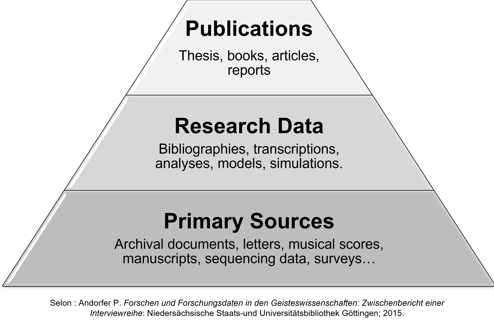

## What is Research Data?

When we talk about Research Data at VU Amsterdam, it is defined as the following:

> "Information that is collected, observed, generated, or reused for the purpose of underpinning academic research. Depending on the discipline, research data may consist of, for example, text, images, audio recordings, video, spreadsheets, databases, statistical data, geographic data, or sensor measurements."

In the context of the [Research Data and Software Management Policy](https://rdm.vu.nl/public/policies-regulations/RDSM-policy-VU-EN-v3.0.pdf), research data refers to the **entirety of the data**, including associated metadata, documentation, and contextual information required to understand, interpret, and reuse the data.

This definition aligns with widely accepted international standards. For example, the Organisation for Economic Co-operation and Development [OECD](https://www.oecd.org/en/publications/oecd-principles-and-guidelines-for-access-to-research-data-from-public-funding_9789264034020-en-fr.html) defines research data as:

> “Factual records (numerical scores, textual records, images, and sounds) used as primary sources for scientific research, and that are commonly accepted in the scientific community as necessary to validate research findings.”

---

## Examples of Research Data

Research data can be created in many formats and through a wide range of research methods. Nearly all academic disciplines produce research data, including mathematics, social sciences, computer science, the humanities, and law.

Examples include:

- Text-based files such as documents, spreadsheets, and presentation slides
- Images, photographs, films, and other visual materials
- Survey data, interview transcripts, and codebooks
- Physical samples and genomic or sequence data
- Laboratory and field notebooks
- Audio and video recordings
- Computer code, algorithms, models, and scripts
- Research methodologies, protocols, and workflows
- Bibliographies and reference datasets

While these examples show the variety of formats, understanding research data also requires looking beyond format to how data are produced, sourced, and regulated.

---

### Categorisation by Production Method

The University of Bristol identifies five main categories of research data based on how they are produced and whether they can be reproduced:

- **Observational**: Data collected in real time within a specific context; typically unique and irreplaceable (e.g. neuroimaging, surveys, field recordings).
- **Experimental**: Data generated using laboratory instruments or standardized methods; potentially reproducible but often costly and time-consuming (e.g. gene sequences, animal experiments).
- **Simulation / Models**: Data produced by computational or experimental models, where the model itself is often the primary research output (e.g. climate or economic models).
- **Derived / Compiled**: Data created by processing, aggregating, or combining raw data (e.g. data mining outputs, compiled databases).
- **Reference**: Curated corpora or collections that serve as authoritative resources in a field (e.g. gene databases, archival collections, historical image databases).

These categories highlight that research data may include both raw materials and processed or curated outputs.

---

### Categorisation by Source, Type, and Privacy Risk

Research data can also be categorised in other ways, including:

- **By source**: primary vs. secondary data
- **By type**: qualitative vs. quantitative data
- **By privacy risk**: personal vs. non-personal data; sensitive vs. non-sensitive data

**Primary vs. Secondary Data**  
Primary data are collected or generated by the researcher specifically for a particular project and are usually gathered for the first time. Secondary data are obtained from existing sources, such as researchers, institutions, companies, databases, publications, or the internet. Secondary data may also include data previously collected for other projects, including earlier work within the same research group.

**Quantitative vs. Qualitative Data**  
Quantitative data consist of numerical information that can be measured, counted, and statistically analyzed (e.g. age, income, temperature, survey ratings). Qualitative data consist of descriptive, non-numerical information such as interview transcripts, observations, open-ended responses, images, or archival documents. These data are typically analyzed using interpretative methods such as thematic or content analysis.

**Personal vs. Non-Personal Data**  
Personal data can be traced back to a living individual and are subject to legal and ethical requirements, including GDPR compliance in Europe. Their use may require additional safeguards, such as secure storage, GDPR registration, or a Data Protection Impact Assessment (DPIA). Ethical review and informed consent procedures are often required when working with personal data. Non-personal data cannot be linked to a living individual, although ethical considerations may still apply.

**Special Categories of Personal Data**  
Certain types of personal data are considered particularly sensitive and require enhanced protection measures. These include health information, genetic and biometric data, racial or ethnic origin, religious or philosophical beliefs, political opinions, sexual orientation, and trade union membership. Additional security measures and consultation with a privacy or data protection officer are recommended when working with these data.

Because research data can take so many forms and functions, it is not always straightforward to determine what qualifies as research data within a specific project. The pyramid below, developed by Andorfer (2015), provided by the University of Geneva, offers a useful conceptual framework for understanding how different types of research data function within the research process, particularly in the social sciences and humanities.

---

## What Is *Not* Research Data?

Although the concept of research data is broad, it is not unlimited. Administrative or operational data—such as HR records, routine email correspondence, or generic software logs—are generally **not** considered research data unless they are explicitly collected or repurposed to answer a research question.

Similarly, publicly available datasets that are reused without modification are not newly created research data. However, their use may still require appropriate documentation, citation, and ethical or legal consideration.

---

## Research Data Across the Research Lifecycle

Beyond defining and categorising research data, it is also important to consider how data evolve over the course of a research project. Research data can be generated at multiple stages, including data collection, processing and analysis, and validation of results. At each stage, multiple versions of data may exist, such as raw data, cleaned or processed data, and derived or aggregated datasets.

Appropriate management of these different forms of research data is essential for ensuring transparency, reproducibility, and long-term reuse, in line with [FAIR data principles](https://rdm.vu.nl/topics/fair-principles.html) (Wilkinson et al., 2016).

---

## Reference and Further Reading

- Andorfer, P. (2015). *Forschen und Forschungsdaten in den Geisteswissenschaften: Zwischenbericht einer Interviewreihe*. Niedersächsische Staats- und Universitätsbibliothek Göttingen.
- Li, M., Marcoux, K., Nazareth, D., Nikuze, A., & Plomp, W. (2025, December). Research Data Management Guidebook for Students. Zenodo. https://doi.org/10.5281/zenodo.15576176
- Organisation for Economic Co-operation and Development. (2007). OECD principles and guidelines for access to research data from public funding. OECD Publishing. https://doi.org/10.1787/9789264034020-en-fr
- University of Geneva. (n.d.). Identify research data. Researchdata. https://www.unige.ch/researchdata/generate-collect/identifier-donnees-de-recherche
- Vrije Universiteit Amsterdam. *Research Data and Software Management (RDSM) Policy, version 3.0*. https://rdm.vu.nl/public/policies-regulations/RDSM-policy-VU-EN-v3.0.pdf
- Wilkinson, M. D., et al. (2016). *The FAIR Guiding Principles for scientific data management and stewardship*. Scientific Data, 3, 160018. https://doi.org/10.1038/sdata.2016.18
